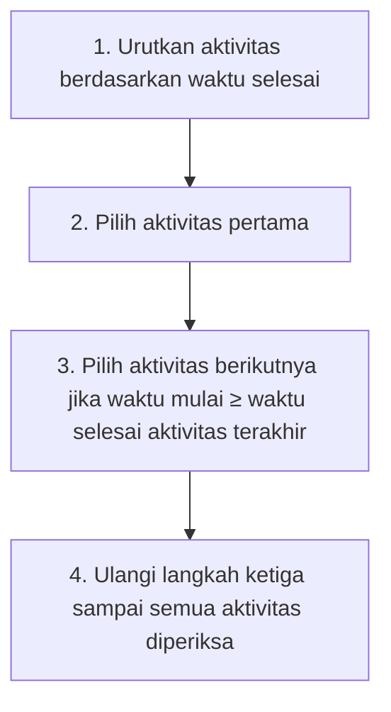

**Activity Selection Problem (ASP)** adalah masalah klasik dalam ilmu komputer yang bertujuan untuk memilih serangkaian aktivitas yang dapat dilakukan dalam satu periode waktu, dengan batasan bahwa aktivitas-aktivitas tersebut tidak boleh tumpang tindih.

ASP banyak ditemukan dalam berbagai situasi di dunia nyata, diantaranya:

- 📅 **Jadwal ruangan**
- 💼 **Wawancara kerja**
- 🏗️ **Pengelolaan sumber daya**

---

## ⚡ Batasan Masalah (Constraints)

### 🚫 Tidak Boleh Ada Tumpang Tindih Aktivitas
Aktivitas yang dipilih harus memiliki waktu mulai yang **lebih besar atau sama** dengan waktu selesai aktivitas yang sebelumnya dipilih.

### ⏰ Hanya Satu Aktivitas dalam Satu Waktu
Kita tidak bisa melakukan lebih dari satu aktivitas yang berlangsung pada waktu yang sama. Artinya, kita harus memikirkan bagaimana cara memanfaatkan waktu yang ada dengan sebaik-baiknya.

---

## 🧠 Dasar Teori dan Konsep Greedy

**Greedy Algorithm** adalah pendekatan pemecahan masalah yang membuat keputusan terbaik atau optimal pada setiap langkah, dengan harapan bahwa keputusan-keputusan lokal yang optimal ini akan menghasilkan solusi yang global optimal.

### 🎯 ASP Cocok Diselesaikan dengan Greedy karena:

- ✅ **Memiliki struktur optimalitas lokal**: Memilih aktivitas yang selesai lebih cepat memberi ruang untuk aktivitas lain
- 🏆 **Solusi optimal terbentuk dari keputusan lokal**

---

## 🛠️ Strategi Penyelesaian dengan Algoritma Greedy

### 📋 Langkah-langkah Penyelesaian ASP

1. 📊 **Urutkan aktivitas** berdasarkan waktu selesai
2. 🎯 **Pilih aktivitas pertama**
3. ➡️ **Pilih aktivitas berikutnya** jika waktu mulai ≥ waktu selesai aktivitas terakhir yang dipilih
4. 🔄 **Ulangi langkah ketiga** sampai semua aktivitas diperiksa

---

## 📊 Kompleksitas

- **⏱️ Time Complexity**: O(n log n) - untuk pengurutan
- **💾 Space Complexity**: O(1) - hanya menggunakan variabel tambahan konstanta

---

## 🎯 Kesimpulan

**Activity Selection Problem (ASP)** adalah masalah optimasi yang sangat umum dalam dunia nyata. Dengan pendekatan greedy, kita dapat menyelesaikannya secara efisien. 

### 🔑 Poin Kunci:
- 🎯 **Prinsip**: Memilih aktivitas yang selesai paling awal
- ⚡ **Efisiensi**: Kesederhanaan logika dan efisiensi waktu komputasi
- 🌍 **Aplikasi**: Cocok diterapkan dalam berbagai aplikasi penjadwalan seperti:
  - 🏫 Pengelolaan kelas
  - 🏢 Penggunaan ruang
  - 💼 Pengaturan wawancara

### 🏆 Keunggulan Solusi:
- ✅ Algoritma sederhana dan mudah dipahami
- ⚡ Efisien dalam waktu komputasi
- 🎯 Memberikan solusi optimal untuk masalah ASP

---